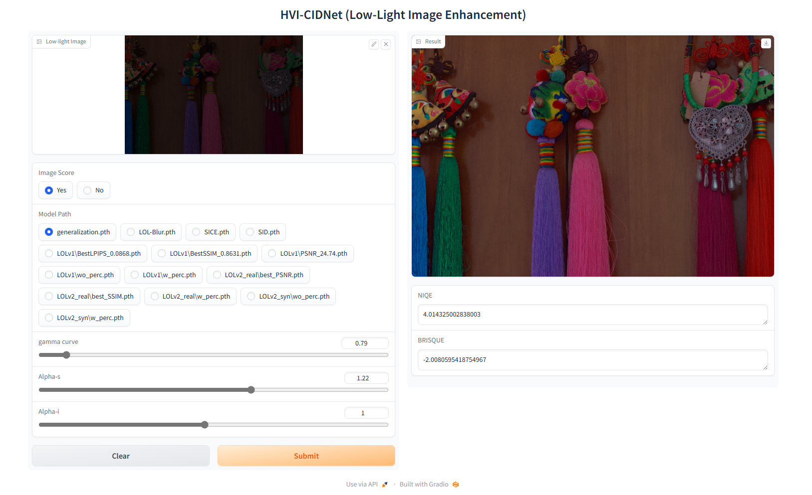
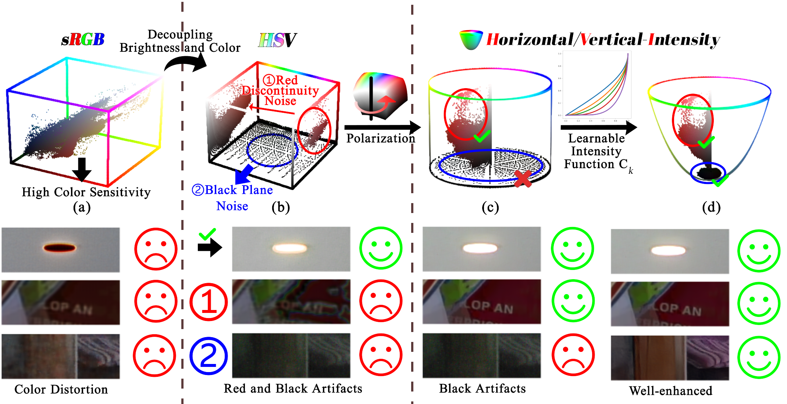
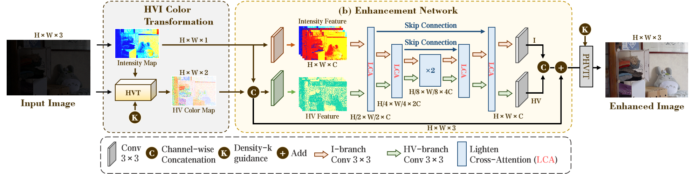
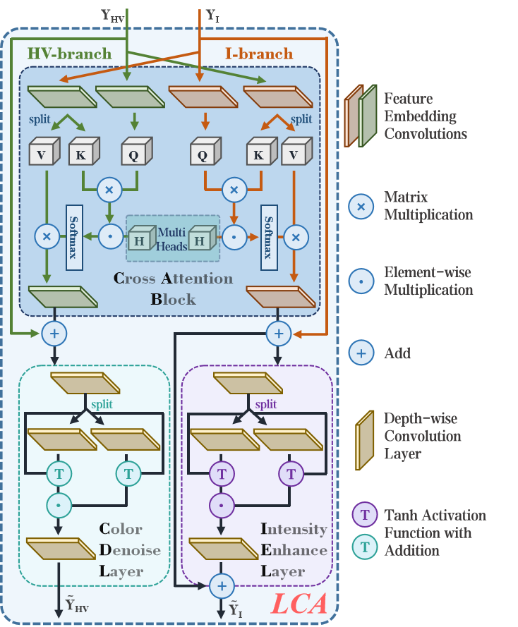

&nbsp;

<p align="center">  </p>

# [CVPR2025] HVI: A New Color Space for Low-light Image Enhancement

**[Qingsen Yan](https://scholar.google.com/citations?user=BSGy3foAAAAJ)<sup>∗ </sup>, [Yixu Feng](https://scholar.google.com/citations?user=WljJ2HUAAAAJ)<sup>∗ </sup>, [Cheng Zhang](https://scholar.google.com/citations?user=L_Av9NcAAAAJ)**,  [Guansong Pang](https://scholar.google.com/citations?user=1ZO7pHkAAAAJ), Kangbiao Shi, [Peng Wu](https://scholar.google.com/citations?user=QkNqUH4AAAAJ), Wei Dong, Jinqiu Sun,  [Yanning Zhang](https://scholar.google.com/citations?user=-wzlS7QAAAAJ)

Previous Version: [You Only Need One Color Space: An Efficient Network for Low-light Image Enhancement](https://arxiv.org/abs/2402.05809)

<div align="center">

[](https://arxiv.org/abs/2502.20272)
[](https://huggingface.co/spaces/Fediory/HVI-CIDNet_Low-light-Image-Enhancement_)
[](https://huggingface.co/papers/2502.20272)
[](https://zhuanlan.zhihu.com/p/27130836644)

[](https://paperswithcode.com/sota/low-light-image-enhancement-on-lime?p=you-only-need-one-color-space-an-efficient)
[](https://paperswithcode.com/sota/low-light-image-enhancement-on-lol?p=you-only-need-one-color-space-an-efficient)

[](https://paperswithcode.com/sota/low-light-image-enhancement-on-lol-v2?p=you-only-need-one-color-space-an-efficient)
[](https://paperswithcode.com/sota/low-light-image-enhancement-on-lol-v2-1?p=you-only-need-one-color-space-an-efficient)


[](https://paperswithcode.com/sota/low-light-image-enhancement-on-lolv2-1?p=you-only-need-one-color-space-an-efficient)
[](https://paperswithcode.com/sota/low-light-image-enhancement-on-npe?p=you-only-need-one-color-space-an-efficient)

[](https://paperswithcode.com/sota/image-enhancement-on-sice-grad?p=you-only-need-one-color-space-an-efficient)
[](https://paperswithcode.com/sota/image-enhancement-on-sice-mix?p=you-only-need-one-color-space-an-efficient)


[](https://paperswithcode.com/sota/low-light-image-enhancement-on-sony-total?p=you-only-need-one-color-space-an-efficient)
[](https://paperswithcode.com/sota/low-light-image-enhancement-on-vv?p=you-only-need-one-color-space-an-efficient)

[](https://paperswithcode.com/sota/low-light-image-deblurring-and-enhancement-on?p=you-only-need-one-color-space-an-efficient)
[](https://paperswithcode.com/sota/low-light-image-enhancement-on-mef?p=you-only-need-one-color-space-an-efficient)


[](https://paperswithcode.com/sota/low-light-image-enhancement-on-dicm?p=you-only-need-one-color-space-an-efficient)
[](https://paperswithcode.com/sota/low-light-image-enhancement-on-lolv2?p=you-only-need-one-color-space-an-efficient)

</div>

&nbsp;

<details open>
<summary><b>HVI-CIDNet Demo:</b></summary>



</details>

## News 🆕
- **2025.07.11** Upgraded version paper as "HVI-CIDNet+: Beyond Extreme Darkness for Low-Light Image Enhancement" in [Arxiv](https://arxiv.org/abs/2507.06814). The new code, models and results will be uploaded soon. (code_link：[Github](https://github.com/shikangbiao/CIDNet_extension))
- **2025.06.03** Special Thanks for Kangbiao Shi for training HVI-CIDNet on FiveK dataset follow retinexformer. The training code and models are avaliable now. 🔆
- **2025.05.01** Our NTIRE2025 LLIE track championship solution, FusionNet, is now public at [Arxiv](https://arxiv.org/pdf/2504.19295)! 📝
- **2025.03.27** Congratulations! Our team achived [1st place](https://drive.google.com/file/d/1CSXNssZQK5Y_KUWUx3_nYLv-plJn_K43/view) in the competition: [NTIRE 2025 Low Light Image Enhancement Challenge](https://codalab.lisn.upsaclay.fr/competitions/21636) (If you have any question about our NTIRE method, please contact: Kangbiao Shi, email: 18334840904@163.com). We fused our HVI-CIDNet with last year's winner and runner-up models to get the optimal results. We will explain the fusion method thoroughly in detail in the report for subsequent reference. 🚀
- **2025.03.10** All weights are public at [Hugging Face](https://huggingface.co/papers/2502.20272). Special Thanks to [Niels Rogge](https://github.com/NielsRogge), [Wauplin](https://github.com/Wauplin), and [hysts](https://huggingface.co/hysts).🔆
- **2025.02.26** Congratulations! Our final-version paper "HVI: A New color space for Low-light Image Enhancement" has been accepted by **CVPR 2025**. 🔥
- **2025.02.20** A test demo of our model is available on [Hugging Face](https://huggingface.co/spaces/Fediory/HVI-CIDNet_Low-light-Image-Enhancement_). 🤗
- **2025.01.31** Update train code. Use random gamma function (enhancement curve) to improve cross-dataset generalization. 🔆
- **2024.06.19** Update newest version of paper in [Arxiv](https://arxiv.org/abs/2402.05809). 📝
- **2024.05.12** Update peer results on LOLv1. 🤝
- **2024.04.28** Synchronize all Baidu Pan datasets, outputs, and weights to One Drive. 🌎
- **2024.04.18** Full version Code, models, visual comparison have been released. We promise that all the weights only trained on train sets, and each weights is reproducible. Hope it will help your future work. If you have trained a better result, please contact us. We look forward to subsequent work based on the HVI color "space"! 💎

- **2024.04.14** Update test fine tuning result and weights on LOLv1 dataset. 🧾

- **2024.03.04** Update five unpaired datasets (DICM, LIME, MEF, NPE, VV) visual results. ✨

- **2024.03.03** Update pre-trained weights and output results on our HVI-CIDNet using Baidu Pan. 🧾

- **2024.02.08** Update HVI-CIDNet original-version paper as "You Only Need One Color Space: An Efficient Network for Low-light Image Enhancement" in [Arxiv](https://arxiv.org/abs/2402.05809v1). The new code, models and results will be uploaded. 🎈


## Proposed HVI-CIDNet ⚙ 

<details open>
<summary><b>Motivation:</b></summary>



</details>

<details close>
<summary><b>HVI-CIDNet pipeline:</b></summary>



</details>

<details close>
<summary><b>Lighten Cross-Attention (LCA) Block structure:</b></summary>




</details>

## Visual Comparison 🖼 
<details close>
<summary><b>LOL-v1, LOL-v2-real, and LOL-v2-synthetic:</b></summary>


</details>

<details close>
<summary><b>DICM, LIME, MEF, NPE, and VV:</b></summary>


</details>
<details close>
<summary><b>LOL-Blur:</b></summary>


</details>

## Weights and Results 🧾
All the weights that we trained on different datasets is available at [[Baidu Pan](https://pan.baidu.com/s/1rvQcQPwsYbtLIYwB3XgjaA?pwd=yixu)] (code: `yixu`) and [[One Drive](https://1drv.ms/f/s!AoPRJmiD24UpgloqG-S67l1BX0cG?e=0b4GL0)] (code: `yixu`).  Results on DICM, LIME, MEF, NPE, and VV datasets can be downloaded from [[Baidu Pan](https://pan.baidu.com/s/1ApI5B1q2GPBHWdh8AafjlQ?pwd=yixu)] (code: `yixu`) and [[One Drive](https://1drv.ms/f/s!AoPRJmiD24UphBK3DimfMTv74FOi?e=3tkhva)] (code: `yixu`). 
**Bolded** fonts represent impressive metrics.

<details close>
<summary><b>The metrics of HVI-CIDNet on paired datasets are shown in the following table: </b></summary>

All the link code is `yixu`.

| Folder (test datasets)                        | PSNR        | SSIM       | LPIPS      | GT Mean | Results                                                      | Weights Path             |
| --------------------------------------------- | ----------- | ---------- | ---------- | ------- | ------------------------------------------------------------ | ------------------------ |
| (LOLv1)<br />v1 w perc loss/ wo gt mean       | 23.8091     | 0.8574     | **0.0856** |         | [Baidu Pan](https://pan.baidu.com/s/1k1_oHDLh8oR47r7RTfB4Hw?pwd=yixu) and [One Drive](https://1drv.ms/u/s!AoPRJmiD24Upgm-DPM6MuNqxcf6L?e=DD1I9g) | LOLv1/w_perc.pth         |
| (LOLv1)<br />v1 w perc loss/ w gt mean        | 27.7146     | 0.8760     | **0.0791** | √       | ditto                                                        | LOLv1/w_perc.pth         |
| (LOLv1)<br />v1 wo perc loss/ wo gt mean      | 23.5000     | **0.8703** | 0.1053     |         | [Baidu Pan](https://pan.baidu.com/s/1hMMh8NNqTLJRSZJ6GxI3rw?pwd=yixu) and [One Drive](https://1drv.ms/u/s!AoPRJmiD24Upgm5MXMToC1-7sFdh?e=c1oKDH) | LOLv1/wo_perc.pth        |
| (LOLv1)<br />v1 wo perc loss/ w gt mean       | **28.1405** | **0.8887** | 0.0988     | √       | ditto                                                        | LOLv1/wo_perc.pth        |
| (LOLv2_real)<br />v2 wo perc loss/ wo gt mean | 23.4269     | 0.8622     | 0.1691     |         | [Baidu Pan](https://pan.baidu.com/s/1Lo19WOrFY3_3wsuJ9gIYnw?pwd=yixu) and [One Drive](https://1drv.ms/u/s!AoPRJmiD24UpgnSzz3Tcg8043ci9?e=OS9ZmS) | (lost)                   |
| (LOLv2_real)<br />v2 wo perc loss/ w gt mean  | 27.7619     | 0.8812     | 0.1649     | √       | ditto                                                        | (lost)                   |
| (LOLv2_real)<br />v2 best gt mean             | **28.1387** | **0.8920** | **0.1008** | √       | [Baidu Pan](https://pan.baidu.com/s/1qewb6u5w1VUaaEzEjFXllQ?pwd=yixu) and [One Drive](https://1drv.ms/u/s!AoPRJmiD24UpgnBE81jKRMU0izoF?e=1Em6cK) | LOLv2_real/w_prec.pth    |
| (LOLv2_real)<br />v2 best Normal              | **24.1106** | 0.8675     | 0.1162     |         | [Baidu Pan](https://pan.baidu.com/s/1V9aMZWEU2D0bVRDmPeNzMQ?pwd=yixu) and [One Drive](https://1drv.ms/u/s!AoPRJmiD24UpgnGqZv_vlFN_u2Bg?e=4CiN6T) | (lost)                   |
| (LOLv2_real)<br />v2 best PSNR                | 23.9040     | 0.8656     | 0.1219     |         | [Baidu Pan](https://pan.baidu.com/s/1PFQ49oa_n7ywTGLl3TUb3A?pwd=yixu) and [One Drive](https://1drv.ms/u/s!AoPRJmiD24UpgnLTGGGFKmXTWBu4?e=JnzL7z) | LOLv2_real/best_PSNR.pth |
| (LOLv2_real)<br />v2 best SSIM                | 23.8975     | **0.8705** | 0.1185     |         | [Baidu Pan](https://pan.baidu.com/s/1zeBPFJS3HxQ9zZZnYGMn4g?pwd=yixu) and [One Drive](https://1drv.ms/u/s!AoPRJmiD24UpgnPhbdKXmSt0YdxU?e=WT8kae) | LOLv2_real/best_SSIM.pth |
| (LOLv2_real)<br />v2 best SSIM/ w gt mean     | **28.3926** | 0.8873     | 0.1136     | √       | None                                                         | LOLv2_real/best_SSIM.pth |
| (LOLv2_syn)<br />syn wo perc loss/ wo gt mean | **25.7048** | **0.9419** | 0.0471     |         | [Baidu Pan](https://pan.baidu.com/s/1ZZtalO3vxqSJOJ58BnfUXw?pwd=yixu) and [One Drive](https://1drv.ms/u/s!AoPRJmiD24UpgnZWp2xWBu8Rv_C_?e=Nn7u4w) | LOLv2_syn/wo_perc.pth    |
| (LOLv2_syn)<br />syn wo perc loss/ w gt mean  | **29.5663** | **0.9497** | 0.0437     | √       | ditto                                                        | LOLv2_syn/wo_perc.pth    |
| (LOLv2_syn)<br />syn w perc loss/ wo gt mean  | 25.1294     | 0.9388     | **0.0450** |         | [Baidu Pan](https://pan.baidu.com/s/1R_ltvaWHJ_sY-unHAEGunw?pwd=yixu) and [One Drive](https://1drv.ms/u/s!AoPRJmiD24UpgnV2ouH4IGy955c6?e=chPtYB) | LOLv2_syn/w_perc.pth     |
| (LOLv2_syn)<br />syn w perc loss/ w gt mean   | 29.3666     | **0.9500** | **0.0403** | √       | ditto                                                        | LOLv2_syn/w_perc.pth     |
| Sony_Total_Dark                               | **22.9039** | **0.6763** | **0.4109** |         | [Baidu Pan](https://pan.baidu.com/s/15w3oMuF3hOtJK29v_xjX3g?pwd=yixu) and [One Drive](https://1drv.ms/u/s!AoPRJmiD24Upgn_ijuk--nBUm6fm?e=4ePpHz) | SID.pth                  |
| LOL-Blur                                      | **26.5719** | **0.8903** | **0.1203** |         | [Baidu Pan](https://pan.baidu.com/s/11zTPd3xrJe0GbEXF_lYHvQ?pwd=yixu) and [One Drive](https://1drv.ms/u/s!AoPRJmiD24Upgn7AOw_WmC9Yg-z0?e=WeiUi8) | LOL-Blur.pth             |
| SICE-Mix                                      | **13.4235** | 0.6360     | 0.3624     | √       | [Baidu Pan](https://pan.baidu.com/s/11x4oJuIKE0iJqdqagG1RhQ?pwd=yixu) and [One Drive](https://1drv.ms/u/s!AoPRJmiD24Upgn1oKivqyksR4ld9?e=JcA0y4) | SICE.pth                 |
| SICE-Grad                                     | **13.4453** | 0.6477     | 0.3181     | √       | [Baidu Pan](https://pan.baidu.com/s/1IICeonyuUHcUfTapa4GKxw?pwd=yixu) and [One Drive](https://1drv.ms/u/s!AoPRJmiD24UpgnyGiBYyTvFyV9gg?e=7veJSh) | SICE.pth                 |
| FiveK<br />follow [Retinexformer](https://github.com/caiyuanhao1998/Retinexformer)                                     | 24.4587 | 0.8769     | 0.0851     |        | [Baidu Pan](https://pan.baidu.com/s/1Cv7SbzVoIA2oyX7sAl5ynA?pwd=yixu) and [One Drive](https://1drv.ms/u/c/2985db836826d183/EWiQ-YME-F9DrMA9r4wt-QIBjFCegAn9fU6WDYXbPwzgbg?e=KKe7q9) | fivek.pth                 |

</details>

<details close>
<summary><b>Performance on five unpaired datasets are shown in the following table:  </b></summary>

| metrics | DICM  | LIME  | MEF   | NPE   | VV    |
| ------- | ----- | ----- | ----- | ----- | ----- |
| NIQE    | 3.79  | 4.13  | 3.56  | 3.74  | 3.21  |
| BRISQUE | 21.47 | 16.25 | 13.77 | 18.92 | 30.63 |

Furthermore, **we found that use random gamma function in the training process can improve the generalization of CIDNet.** You can see details in `train.py` line 53-55, also you can turn-on the random-gamma mode in `data/options.py` line 60 during training process.

We trained on LOLv2-Syn dataset with the random-gamma mode, and save the weights as `LOLv2_syn/generalization.pth` (you can find in the link). The performance are shown in the following table, and you can see 7 metrics improved:

| metrics | DICM  | LIME  | MEF   | NPE   | VV    | Results                                                      |
| ------- | ----- | ----- | ----- | ----- | ----- | ------------------------------------------------------------ |
| NIQE    | 3.55  | 3.85  | 3.46  | 3.82  | 3.24  | [Baidu Pan](https://pan.baidu.com/s/1hhsWpcqqMyMnSogDCm_MXg?pwd=yixu) and [One Drive](https://1drv.ms/f/c/2985db836826d183/Eu7lGsiqJplMra5SIV5-HGcBeBE7LI9qbGR7q6RltthBSA?e=BDaRAP) |
| BRISQUE | 25.62 | 16.02 | 13.08 | 18.90 | 29.55 | ditto                                                        |

The weights with the "strongest" generalization ability we put on the HVI-CIDNet demo on the Hugging Face website, which we highly recommend. Here are its NIQE metrics on five unpaired datasets, which you can easily reproduce on Hugging Face:

| metrics | DICM  | LIME  | MEF   | NPE   | VV    | Average |
| ------- | ----- | ----- | ----- | ----- | ----- | ------- |
| NIQE    | 3.36  | 3.03  | 3.11  | 3.33  | 2.49  | 3.13    |

</details>

<details close>
<summary><b>Test Finetune:  </b></summary>

- While we don't recommend that you perform finetuning on the test set, in order to demonstrate the effectiveness of our model, we also provide here the results of test finetuning training on the LOLv1 dataset. **Using the fine tuning technique on the test set does make the PSNR metrics higher**, but other metrics are not found to be significantly changed on CIDNet, which may result in a lower generalization of the model, so we do not recommend you do this.

| Folder (test datasets)          | PSNR        | SSIM   | LPIPS      | GT Mean | Results                                                      | Weights Path              |
| ------------------------------- | ----------- | ------ | ---------- | ------- | ------------------------------------------------------------ | ------------------------- |
| (LOLv1)<br />v1 test finetuning | **25.4036** | 0.8652 | **0.0897** |         | [Baidu Pan](https://pan.baidu.com/s/1MmUVF4orRWFXURJ4Pnbz2w?pwd=yixu) and [One Drive](https://1drv.ms/u/s!AoPRJmiD24Upgm0szyqstv-exKcV?e=rLXoby) | LOLv1/test_finetuning.pth |
| (LOLv1)<br />v1 test finetuning | **27.5969** | 0.8696 | 0.0869     | √       | ditto                                                        | ditto                     |
</details>

<details close>
<summary><b>Contributions from other peers: </b></summary>

- This section is where other peers have trained better versions of weights using our model, and we will show both their weights and results here. If you have trained better weights, please contact us by email or submit issue.

| Datasets | PSNR        | SSIM   | LPIPS  | GT Mean | Results                                                      | Weights Path               | Contributor Detail                              | GPU         |
| -------- | ----------- | ------ | ------ | ------- | ------------------------------------------------------------ | -------------------------- | ----------------------------------------------- | ----------- |
| LOLv1    | **24.7401** | 0.8604 | 0.0896 |         | [Baidu Pan](https://pan.baidu.com/s/1JKFG9UfZdHA0gyhrT-6Ruw?pwd=yixu) and [One Drive](https://1drv.ms/u/s!AoPRJmiD24UphCmA1BKfzVUjQDZF?e=cOELSz) | LOLv1/other/PSNR_24.74.pth | [Xi’an Polytechnic University]<br />Yingjian Li | NVIDIA 4070 |

</details>

## 1. Get Started 🌑

### Dependencies and Installation

- Python 3.7.0
- Pytorch 1.13.1

(1) Create Conda Environment

```bash
conda create --name CIDNet python=3.7.0
conda activate CIDNet
```

(2) Clone Repo

```bash
git clone git@github.com:Fediory/HVI-CIDNet.git
```

(3) Install Dependencies

```bash
cd HVI-CIDNet
pip install -r requirements.txt
```


### Data Preparation

You can refer to the following links to download the datasets. Note that we only use `low_blur` and `high_sharp_scaled` subsets of `LOL-Blur` dataset.

- [LOLv1](https://daooshee.github.io/BMVC2018website/)
- LOLv2: [Baidu Pan](https://pan.baidu.com/s/17KTa-6GUUW22Q49D5DhhWw?pwd=yixu) (code: `yixu`) and  [One Drive](https://1drv.ms/u/c/2985db836826d183/EYPRJmiD24UggCmCAQAAAAABEbg62rx0FG21FwLQq0jzLg?e=Im12UA) (code: `yixu`) 
- LOL-Blur: [Baidu Pan](https://pan.baidu.com/s/1nj054uoLA3gtpV7MNM2eCA?pwd=yixu)(code: `yixu`) and [One Drive](https://1drv.ms/u/s!AoPRJmiD24UphBTn9PsLC5hoD-k9?e=Jm0AOa) (code: `yixu`) 
- DICM,LIME,MEF,NPE,VV: [Baidu Pan](https://pan.baidu.com/s/1FZ5HWT30eghGuaAqqpJGaw?pwd=yixu)(code: `yixu`) and [One Drive](https://1drv.ms/f/s!AoPRJmiD24UphBNGBbsDmSwppNPf?e=2yGImv)(code: `yixu`)
- SICE: [Baidu Pan](https://pan.baidu.com/s/13ghnpTBfDli3mAzE3vnwHg?pwd=yixu)(code: `yixu`) and [One Drive](https://1drv.ms/u/s!AoPRJmiD24UphAlaTIekdMLwLZnA?e=WxrfOa)(code: `yixu`)
- Sony-Total-Dark(SID): [Baidu Pan](https://pan.baidu.com/s/1mpbwVscbAfQJtkrrzBzJng?pwd=yixu)(code: `yixu`) and [One Drive](https://1drv.ms/u/s!AoPRJmiD24UphAie9l0DuMN20PB7?e=Zc5DcA)(code: `yixu`)
- FiveK (follow [Retinexformer](https://github.com/caiyuanhao1998/Retinexformer)): [Baidu Disk](https://pan.baidu.com/s/1ajax7N9JmttTwY84-8URxA?pwd=cyh2) (code:`cyh2`), [Google Drive](https://drive.google.com/file/d/11HEUmchFXyepI4v3dhjnDnmhW_DgwfRR/view?usp=sharing)

Then, put them in the following folder:

<details close> <summary>datasets (click to expand)</summary>

```
├── datasets
	├── DICM
	├── FiveK
		├── test
			├──input
			├──target
		├── train
			├──input
			├──target
	├── LIME
	├── LOLdataset
		├── our485
			├──low
			├──high
		├── eval15
			├──low
			├──high
	├── LOLv2
		├── Real_captured
			├── Train
				├── Low
				├── Normal
			├── Test
				├── Low
				├── Normal
		├── Synthetic
			├── Train
				├── Low
				├── Normal
			├── Test
				├── Low
				├── Normal
	├── LOL_blur
		├── eval
			├── high_sharp_scaled
			├── low_blur
		├── test
			├── high_sharp_scaled
				├── 0012
				├── 0017
				...
			├── low_blur
				├── 0012
				├── 0017
				...
		├── train
			├── high_sharp_scaled
				├── 0000
				├── 0001
				...
			├── low_blur
				├── 0000
				├── 0001
				...
	├── MEF
	├── NPE
	├── SICE
		├── Dataset
			├── eval
				├── target
				├── test
			├── label
			├── train
				├── 1
				├── 2
				...
		├── SICE_Grad
		├── SICE_Mix
		├── SICE_Reshape
	├── Sony_total_dark
		├── eval
			├── long
			├── short
		├── test
			├── long
				├── 10003
				├── 10006
				...
			├── short
				├── 10003
				├── 10006
				...
		├── train
			├── long
				├── 00001
				├── 00002
				...
			├── short
				├── 00001
				├── 00002
				...
	├── VV
```
</details>

## 2. Testing 🌒


Download our weights from [[Baidu Pan](https://pan.baidu.com/s/1rvQcQPwsYbtLIYwB3XgjaA?pwd=yixu)] (code: `yixu`) and put them in folder `weights`:

<details close> <summary>weights (click to expand)</summary>

```
├── weights
    ├── LOLv1
        ├── w_perc.pth
        ├── wo_perc.pth
        ├── test_finetuning.pth
    ├── LOLv2_real
        ├── best_PSNR.pth
        ├── best_SSIM.pth
        ├── w_perc.pth
    ├── LOLv2_syn
        ├── generalization.pth
        ├── w_perc.pth
        ├── wo_perc.pth
    ├── LOL-Blur.pth
    ├── SICE.pth
    ├── SID.pth
```

</details>

- **You can test our method in our gradio demo with bash code `python app.py`, and go to the URL link "http://127.0.0.1:7862" to enjoy the demo.** (add `--cpu` can inference CPU-only)
- or You can use `huggingface_hub` to download and test our method as:
```bash
# you can find all weights in https://huggingface.co/papers/2502.20272
python eval_hf.py --path fediory/our_model_path --input_img your/img/path --alpha_s 1.0 --alpha_i 1.0 --gamma 1.0

# for example
python eval_hf.py --path fediory/HVI-CIDNet-LOLv1-wperc --input_img ./datasets/DICM/01.JPG --alpha_s 1.0 --alpha_i 1.0 --gamma 1.0
```
and your enhanced image will be saved at `./output_hf`.

- or **You can test our method as followed, all the results will saved in `./output` folder:**

<details close> <summary>(click to expand)</summary>

```bash
# LOLv1
python eval.py --lol --perc # weights that trained with perceptual loss
python eval.py --lol # weights that trained without perceptual loss

# LOLv2-real
python eval.py --lol_v2_real --best_GT_mean # you can choose best_GT_mean or best_PSNR or best_SSIM

# LOLv2-syn
python eval.py --lol_v2_syn --perc # weights that trained with perceptual loss
python eval.py --lol_v2_syn # weights that trained without perceptual loss

# SICE
python eval.py --SICE_grad # output SICE_grad
python eval.py --SICE_mix # output SICE_mix

# FiveK
python eval.py --fivek # output FiveK follow Retinexformer

# Sony-Total-Dark
python eval_SID_blur --SID

# LOL-Blur
python eval_SID_blur --Blur

# five unpaired datasets DICM, LIME, MEF, NPE, VV. 
# We note that: you can choose one weights in ./weights folder, and set the alpha float number (defualt=1.0) as illumination scale of the datasets.
# gamma denotes the gamma function (curve), see line 59 of "eval.py"
# You can change "--DICM" to the other unpaired datasets "LIME, MEF, NPE, VV".
python eval.py --unpaired --DICM --unpaired_weights --alpha
# e.g.
python eval.py --unpaired --DICM --unpaired_weights ./weights/LOLv2_syn/w_perc.pth --alpha 0.9 --gamma 0.9

# Custome Datasets: alpha and gamma are optional.
python eval.py --unpaired --custome --custome_path ./your/costome/dataset/path --unpaired_weights ./weights/LOLv2_syn/w_perc.pth --alpha 0.9 --gamma 0.9
```

</details>

- **Also, you can test all the metrics mentioned in our paper as follows:**
  
  
<details close> <summary>(click to expand)</summary>

```bash
# LOLv1
python measure.py --lol

# LOLv2-real
python measure.py --lol_v2_real

# LOLv2-syn
python measure.py --lol_v2_syn

# Sony-Total-Dark
python measure_SID_blur.py --SID

# LOL-Blur
python measure_SID_blur.py --Blur

# SICE-Grad
python measure.py --SICE_grad

# SICE-Mix
python measure.py --SICE_mix

# fivek
python measure.py --fivek


# five unpaired datasets DICM, LIME, MEF, NPE, VV. 
# You can change "--DICM" to the other unpaired datasets "LIME, MEF, NPE, VV".
python measure_niqe_bris.py --DICM


# Note: Following LLFlow, KinD, and Retinxformer, we have also adjusted the brightness of the output image produced by the network, based on the average value of GroundTruth (GT). This only works in paired datasets. If you want to measure it, please add "--use_GT_mean".
# 
# e.g.
python measure.py --lol --use_GT_mean
  
```

</details>

- **Evaluating the Parameters, FLOPs, and running time of HVI-CIDNet:**

```bash
python net_test.py
```


## 3. Training 🌓

- We put all the configurations that need to be adjusted in the `./data/options.py` folder and explained them in the file. We apologize that some of the training parameters we are no longer able to provide and share with you, but we guarantee that all the weights are trainable by parameter tuning. You can train our HVI-CIDNet by:

```bash
python train.py
```

- All weights are saved to the `./weights/train` folder and are saved in steps of the checkpoint set in the `options.py`  as `epoch_*.pth` where `*` represent the epoch number.
- Also, for every weight saved, metrics are measured for the validation set and printed to the command line. Finally, the results of all weights' test metrics on the validation set and options in `./data/options.py` will be saved to `./results/training/metrics-YYYY-mm-dd-HHMMSS.md`.
- In each epoch, we save an output (test) and GT image to the `./results/training` folder to facilitate the visualization of the training results and progress of each epoch, as well as to detect the generation of gradient explosion in advance.
- After each checkpoint, we save all the validation set outputs for this time in the `./results` folder to the corresponding folder. Note that we use a replacement strategy for different checkpoints for each dataset. That is, we do not save the plots of all checkpoints, but only the weights of each checkpoint.
  

## 4. Contacts 🌔

If you have any questions, please contact us or submit an issue to the repository!

Yixu Feng (yixu-nwpu@mail.nwpu.edu.cn)

## 5. Citation 🌕

If you find our work useful for your research, please cite our paper

```
@article{yan2025hvi,
  title={HVI: A New color space for Low-light Image Enhancement},
  author={Yan, Qingsen and Feng, Yixu and Zhang, Cheng and Pang, Guansong and Shi, Kangbiao and Wu, Peng and Dong, Wei and Sun, Jinqiu and Zhang, Yanning},
  journal={arXiv preprint arXiv:2502.20272},
  year={2025}
}

@misc{feng2024hvi,
      title={You Only Need One Color Space: An Efficient Network for Low-light Image Enhancement}, 
      author={Yixu Feng and Cheng Zhang and Pei Wang and Peng Wu and Qingsen Yan and Yanning Zhang},
      year={2024},
      eprint={2402.05809},
      archivePrefix={arXiv},
      primaryClass={cs.CV}
}
```

